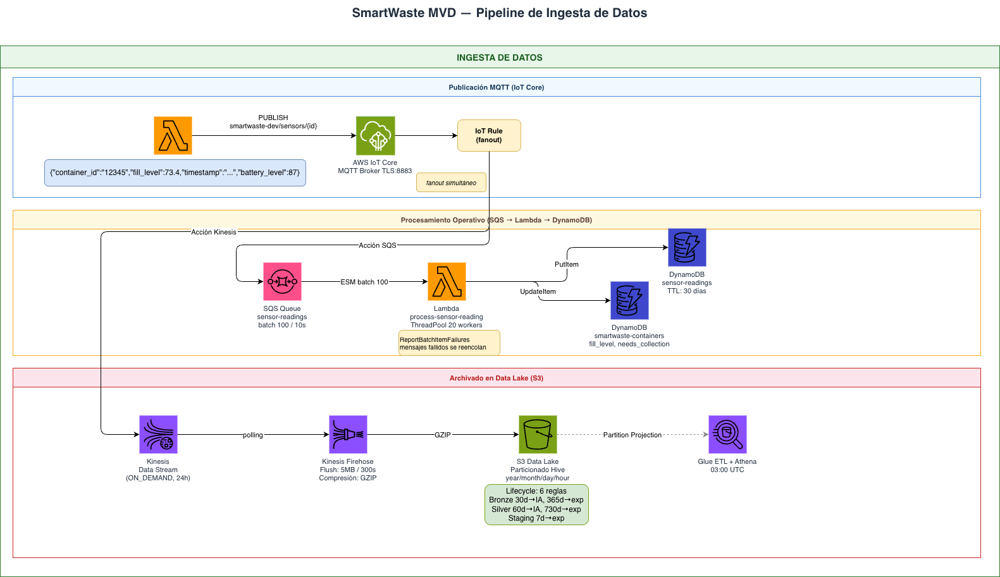
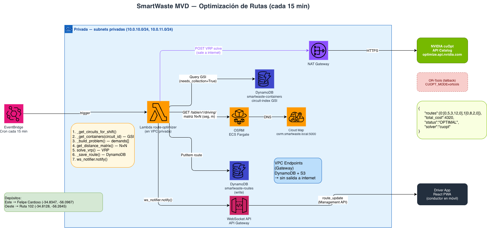
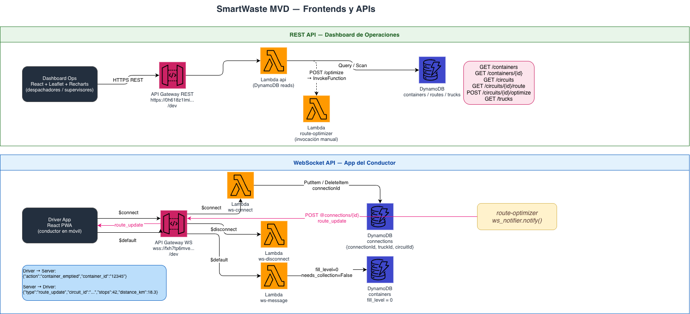

# Arquitectura SmartWaste MVD

Sistema de optimización de rutas en tiempo real para recolección de residuos en Montevideo, Uruguay. ~13.000 contenedores, 117 circuitos, 3 turnos diarios.

---

## Diagrama general

Los diagramas de arquitectura están disponibles en formato draw.io (con logos de servicios AWS) en `docs/diagrams/`.
Para exportarlos como imagen: abrí cada archivo en [draw.io](https://app.diagrams.net) → **File → Export as → PNG**.

### 1. Pipeline de Ingesta de Datos



> Fuente editable: [`docs/diagrams/01-data-ingestion.drawio`](diagrams/01-data-ingestion.drawio)

```
Sensor Simulator (Lambda)
    │ MQTT PUBLISH smartwaste-dev/sensors/{id}
    ▼
AWS IoT Core (TLS:8883)
    │ IoT Rule — fanout simultáneo (2 acciones)
    ├──── Acción SQS ────▶ SQS sensor-readings ──▶ process-sensor-reading ──▶ DynamoDB containers (UpdateItem fill_level)
    │                       (batch 100 msgs / 10s)  (batch SQS, ThreadPool)  └▶ DynamoDB sensor-readings (PutItem, TTL 30d)
    └──── Acción Kinesis ─▶ Kinesis Data Stream ──▶ Kinesis Firehose ──▶ S3 Data Lake
                            (ON_DEMAND, 24h)                                  (GZIP, Hive partitions)
                                                                              └▶ Glue ETL (03:00 UTC)
                                                                                   └▶ Athena queries
                                                                                   └▶ S3 analytics-results/
                                                                                   └▶ API /analytics/*
```

### 2. Optimización de Rutas (VPC Privada)



> Fuente editable: [`docs/diagrams/02-route-optimization.drawio`](diagrams/02-route-optimization.drawio)

```
EventBridge (cron cada 15 min)
    │
    ▼
Lambda route-optimizer  [VPC: subnets privadas 10.0.10.0/24, 10.0.11.0/24]
    ├── Query DynamoDB circuit-index GSI  (needs_collection=True)
    ├── GET OSRM ECS Fargate  /table/v1/driving/  → matriz N×N (seg, m)
    │        └── Cloud Map DNS: osrm.smartwaste.local:5000
    ├── POST NVIDIA cuOpt API  (via NAT Gateway → internet)
    │        └── fallback: OR-Tools local (CUOPT_MODE=ortools)
    ├── PutItem DynamoDB routes
    └── ws_notifier.notify() → WebSocket API → Driver App
```

### 3. Frontends y APIs



> Fuente editable: [`docs/diagrams/03-frontend-apis.drawio`](diagrams/03-frontend-apis.drawio)

```
Dashboard Ops (React + Leaflet + Recharts)
    ├── HTTPS REST ──▶ API Gateway REST /dev ──▶ Lambda api ──▶ DynamoDB
    │                                            ├── POST /optimize → Lambda route-optimizer
    │                                            └── GET /analytics/* → S3 analytics-results/
    └── Vista Analytics: heatmap + charts + alertas (datos del ETL nocturno)

Driver App (React PWA)
    ├── $connect  ──▶ API Gateway WS /dev ──▶ Lambda ws-connect    → DynamoDB connections (PutItem)
    ├── $default  ──▶                      ──▶ Lambda ws-message    → DynamoDB containers (fill_level=0)
    └── $disconnect ▶                      ──▶ Lambda ws-disconnect → DynamoDB connections (DeleteItem)
    ◀── route_update ── route-optimizer (ws_notifier) → POST @connections/{id}
```

---

## Componentes

### 1. Sensor Simulator (`simulator/`)

Simula las lecturas de sensores IoT de los contenedores. En producción sería reemplazado por dispositivos físicos conectados a IoT Core.

**Cómo funciona:**
- Lee la lista de contenedores del circuito asignado desde DynamoDB.
- Para cada contenedor calcula el nivel de llenado usando una **curva logística** que depende de:
  - Tiempo transcurrido desde el último vaciado (fill rate base)
  - Factor de densidad por zona (`zone_density.py`)
  - Factor de variación horaria y día de la semana (`fill_model.py`)
- Publica lecturas por MQTT al topic `smartwaste-dev/sensors/{container_id}` cada 60 segundos.

**Mensajes MQTT publicados:**
```json
{
  "container_id": "12345",
  "fill_level":   73.4,
  "timestamp":    "2025-01-15T14:30:00Z",
  "battery_level": 87
}
```

**Ficheros clave:**
| Fichero | Responsabilidad |
|---------|-----------------|
| `simulator.py` | Entry point, orquesta el loop de publicación |
| `fill_model.py` | Curva logística con factores horarios y semanales |
| `zone_density.py` | Densidad de llenado por zona (este/oeste) |
| `mqtt_publisher.py` | Conexión TLS a IoT Core, publicación y reconexión |

**Topics MQTT:**
```
smartwaste-dev/sensors/{container_id}          ← sensores publican lecturas
smartwaste-dev/trucks/{truck_id}/position      ← GPS publica posición
smartwaste-dev/routes/{truck_id}/current       ← driver app suscribe
```

---

### 2. AWS IoT Core

Broker MQTT gestionado. Recibe conexiones TLS (puerto 8883) de los simuladores (y en producción, de los dispositivos físicos).

**Configuración Terraform (`terraform/iot.tf`):**
- `aws_iot_thing_type` — tipo `WasteContainer` con atributos buscables: `circuit_id`, `zone`, `shift`
- `aws_iot_policy` — política de mínimo privilegio:
  - Connect: solo clientIds con prefijo `smartwaste-`
  - Publish: solo topics `sensors/*` y `trucks/*/position`
  - Subscribe/Receive: tree completo `smartwaste/`

**IoT Rules (2 acciones en paralelo por mensaje):**

| Acción | Destino | Condición |
|--------|---------|-----------|
| `sqs` | `smartwaste-dev-sensor-readings` (SQS queue) → Lambda event source mapping (batch 100, 10s) | `SELECT * FROM 'smartwaste-dev/sensors/+'` |
| `kinesis` | `sensor-stream` | mismo topic — para el Data Lake |

El **fanout** permite que cada lectura actualice DynamoDB (operativo) Y se archive en S3 (analítico) sin acoplar los dos flujos. El paso por SQS evita el throttling de concurrencia Lambda: ~10.937 invocaciones simultáneas se consolidan en ~110 batches de 100 mensajes.

---

### 3. Lambda `process-sensor-reading`

Actualiza el estado operativo del contenedor en DynamoDB. Recibe mensajes en **batch via SQS** (batch_size=100, max_batching_window=10s) y los procesa en paralelo con `ThreadPoolExecutor` (20 workers).

**Lógica por mensaje:**
1. Recibe batch de hasta 100 mensajes desde SQS (event source mapping).
2. Para cada mensaje en paralelo (ThreadPoolExecutor, 20 workers, pool_connections=25):
   a. `UpdateItem` en `smartwaste-dev-containers`:
      - `fill_level` = valor recibido
      - `last_reading` = timestamp
      - `needs_collection` = `True` si `fill_level >= 70` (umbral configurable)
   b. `PutItem` en `smartwaste-dev-sensor-readings` (time-series):
      - `container_id` + `timestamp` como PK compuesta
      - `ttl` = `now + 30 días` (DynamoDB TTL limpia automáticamente)
3. Implementa `ReportBatchItemFailures`: los mensajes fallidos se reencolan sin afectar los exitosos.

**No hace routing ni optimización** — eso es responsabilidad del route-optimizer.

---

### 4. Data Lake — Ingesta (`terraform/kinesis.tf`)

Dos pipelines paralelos al flujo operativo archivan datos en S3 para análisis histórico:

```
IoT Rule ──kinesis:PutRecord──▶ Kinesis Data Stream (ON_DEMAND, 24h)
                                        │
                              Firehose sensor-readings (polling KDS)
                                        │
                              s3://smartwaste-data-lake-dev/bronze/sensor-readings/
                              Compresión GZIP, flush 5 MB o 300 s

route-optimizer ──Direct PUT──▶ Firehose route-results
                                        │
                              s3://smartwaste-data-lake-dev/bronze/route-results/
```

Los archivos Bronze usan particionamiento Hive-compatible (`year=/month=/day=/hour=`) para que Athena aproveche **Partition Projection** sin Glue Crawler.

**Lifecycle S3 (6 reglas consolidadas en 1 recurso Terraform):**

| Prefijo | STANDARD_IA | Expiración | Capa |
|---------|-------------|------------|------|
| `sensor-readings/` | Día 30 | Día 365 | Bronze |
| `route-results/` | Día 30 | Día 365 | Bronze |
| `sensor-readings-parquet/` | Día 60 | Día 730 | Silver |
| `route-results-parquet/` | Día 60 | Día 730 | Silver |
| `analytics-results/` | Día 30 | Día 365 | Gold |
| `athena-results/` | — | Día 7 | Staging |

> Para el detalle completo de ingesta, estructura de buckets, catálogo Glue y ETL, ver **[docs/datalake.md](datalake.md)**.

---

### 5. Data Lake — ETL y Analytics (`terraform/analytics.tf`, `lambdas/glue-analytics/etl_daily.py`)

Pipeline de análisis histórico con arquitectura medallón Bronze → Silver → Gold. Corre cada noche a las **03:00 UTC** (medianoche en Montevideo).

```
Bronze (raw GZIP JSON)
    │
    ▼ Glue PySpark Job (Glue 4.0, 2×G.1X workers)
    │   ├── Lee sensor-readings y route-results Bronze
    │   ├── Resuelve el problema del GZIP concatenado de Firehose
    │   ├── Enriquece con metadata de DynamoDB
    │   ├── Deduplica rutas (Window: último run por circuito)
    │   └── Escribe Parquet particionado
    ▼
Silver (Parquet, compresión snappy)
    ├── sensor-readings-parquet/
    └── route-results-parquet/
    │
    ▼ Continuación del mismo job
Gold (JSON pre-computados para la API)
    ├── analytics-results/latest.json            ← resumen del día anterior
    ├── analytics-results/daily/YYYY-MM-DD.json  ← snapshot histórico
    ├── analytics-results/trends/latest-trends.json  ← rolling 30 días
    └── analytics-results/route-efficiency-trends.json ← eficiencia de rutas
    │
    ▼
Lambda api → GET /analytics/summary
           → GET /analytics/trends
           → GET /analytics/route-efficiency
    │
    ▼
Frontend Dashboard (vista Analytics)
```

**Glue Data Catalog:** 4 tablas en `smartwaste-dev-analytics` — `sensor_readings`, `sensor_readings_parquet`, `route_results`, `route_results_parquet`. Todas usan Partition Projection; sin Crawlers.

**Athena:** Workgroup `smartwaste-dev-analytics`, Engine v3, límite 100 MB/query. Disponible para consultas ad-hoc sobre Silver.

**Costos estimados (dev):** ~$28/mes (dominado por Firehose + Glue PySpark).

> Para una descripción exhaustiva del ETL, el problema del GZIP concatenado, las Window functions de deduplicación, las predicciones logísticas con scipy, los schemas de Gold y los roles IAM, ver **[docs/datalake.md](datalake.md)**.

---

### 6. Lambda `route-optimizer` (`lambdas/route-optimizer/handler.py`)

El corazón del sistema. Se ejecuta **cada 15 minutos** por EventBridge para cada circuito/turno activo.

También puede invocarse manualmente (desde el dashboard ops o via CLI):
```bash
aws lambda invoke --function-name smartwaste-dev-route-optimizer \
  --payload '{"circuit_id":"A_DU_RM_CL_103"}' /tmp/out.json
```

**Flujo interno:**
```
_get_circuits_for_shift()
    │  Determina qué circuitos están activos ahora
    ▼
_get_containers(circuit_id)
    │  Query GSI circuit-index en DynamoDB
    │  Filtra: needs_collection=True (>= 70% llenado)
    │  Si < 5 contenedores → skip (no compensa enviar un camión)
    ▼
_build_problem()
    │  locations = [depot] + containers + [depot_end]
    │  demands   = [0]     + [kg × fill] + [0]
    │  Calcula kg con constraints.estimate_demand_kg()
    ▼
OSRMClient.get_distance_matrix(locations)
    │  GET /table/v1/driving/{coords}?annotations=duration,distance
    │  → cost_matrix N×N (segundos, enteros)
    │  → dist_matrix N×N (metros)
    ▼
CuOptSolver.solve_vrp(...)    [o ORToolsSolver si CUOPT_MODE=ortools]
    │  POST https://optimize.api.nvidia.com/v1/nvidia/cuopt
    │  → {routes, total_cost, status, solver}
    ▼
_save_route()
    │  PutItem en DynamoDB routes
    │  Incluye geometría real de calles (OSRM Route API)
    ▼
ws_notifier.notify()
    │  POST a cada conexión WebSocket activa del circuito
    └─ Drivers reciben route_update en tiempo real
```

**Depósitos:**
| Zona | Depósito | Lat/Lon |
|------|----------|---------|
| Este (circuitos impares) | Felipe Cardoso | -34.8347, -56.0967 |
| Oeste (circuitos pares) | Ruta 102 | -34.8128, -56.2645 |

**Configuración de camiones:** 3 camiones por circuito, 25.000 kg de capacidad c/u.

---

### 6. OSRM — Open Source Routing Machine (`osrm/`)

Self-hosted en ECS Fargate. Calcula matrices de distancias y rutas reales de calles usando datos de OpenStreetMap para Uruguay.

**¿Por qué self-hosted y no Google Maps?**
- Sin costo por request (Google Maps: $5/1000 elementos de la matriz)
- Sin límite de 25×25 elementos en la Matrix API
- Latencia < 50ms desde la VPC (vs ~200ms a Google)
- Datos OSM Uruguay actualizados mensualmente

**Imagen Docker (`osrm/Dockerfile.ecr`):**
- Base: Debian con osrm-backend
- Datos pre-procesados embedidos: Uruguay OSM + perfil de camión pesado
- Health check: `curl 'http://127.0.0.1:5000/nearest/v1/driving/-56.1645,-34.9011'`
- Nota: usa `archive.debian.org` (Debian Stretch EOL)

**ECS Fargate (`terraform/ecs.tf`):**
- Cluster: `smartwaste-dev-cluster`
- Service: `smartwaste-dev-osrm`
- CPU: `2048` (2 vCPU) / Memoria: `4096` MB (4 GB)
- Subnets privadas (solo accesible desde la VPC)
- Cloud Map DNS: `osrm.smartwaste.local:5000`
- ECR: `<YOUR_AWS_ACCOUNT_ID>.dkr.ecr.us-east-1.amazonaws.com/smartwaste-dev-osrm`

**APIs usadas:**

| Endpoint | Uso | Descripción |
|----------|-----|-------------|
| `GET /table/v1/driving/{coords}` | route-optimizer | Matriz N×N de tiempos y distancias |
| `GET /route/v1/driving/{coords}` | handler.py | Geometría real de la ruta para el mapa |

```python
# Table API — respuesta
{
  "durations": [[0, 120, 85, ...], ...],   # segundos N×N
  "distances": [[0, 980, 720, ...], ...]   # metros N×N
}
```

**Fallback haversine:** cuando `OSRM_FALLBACK=haversine` (dev sin OSRM disponible), `osrm_client.py` genera una matriz sintética usando distancia geográfica × 1.35 (factor detour urbano) a 30 km/h.

---

### 7. NVIDIA cuOpt — Solver VRP (`cuopt-client/`)

Resuelve el CVRP (Capacitated Vehicle Routing Problem) usando GPU. Ver `cuopt-client/README.md` y `docs/cuopt-implementation.md` para documentación detallada.

**Modos de operación:**

| `CUOPT_MODE` | Endpoint | Uso |
|---|---|---|
| `api_catalog` | `https://optimize.api.nvidia.com/v1/nvidia/cuopt` | **Producción actual** (free tier: 5K req/mes) |
| `self_hosted` | URL configurable (EC2 GPU / Docker) | Migración futura |
| `ortools` | librería local | Fallback dev/CI |

**Módulos:**
```
cuopt-client/
  vrp_solver.py     — CuOptSolver + ORToolsSolver (misma interfaz)
  osrm_client.py    — Matriz de distancias desde OSRM
  constraints.py    — Cálculo de demanda en kg y ventanas de tiempo por turno
  test_solver.py    — Test funcional con datos sintéticos de MVD
```

**Resultado:**
```python
{
    "routes":     {0: [0, 5, 3, 12, 0], 1: [0, 8, 2, 0]},
    "total_cost": 4320,      # segundos totales de conducción
    "status":     "OPTIMAL", # OPTIMAL | FEASIBLE | INFEASIBLE
    "solver":     "cuopt"
}
```

---

### 8. DynamoDB — Tablas operativas (`terraform/dynamodb.tf`)

Todas las tablas usan `PAY_PER_REQUEST` (on-demand). Costo cero en dev cuando no hay tráfico.

#### `smartwaste-dev-containers`

| Atributo | Tipo | Descripción |
|----------|------|-------------|
| `container_id` | PK (S) | ID del gid de Intendencia |
| `circuit_id` | GSI PK (S) | Circuito al que pertenece |
| `fill_level` | N | Nivel actual (0–100%) |
| `needs_collection` | BOOL | `fill_level >= 70` |
| `latitude` / `longitude` | N | WGS84 |
| `capacity_liters` | N | Capacidad del contenedor (default 2400 L) |
| `last_reading` | S | ISO 8601 UTC |

GSI `circuit-index` → permite al route-optimizer consultar todos los contenedores de un circuito con una sola query.

#### `smartwaste-dev-trucks`

| Atributo | Tipo | Descripción |
|----------|------|-------------|
| `truck_id` | PK (S) | ID del camión |
| `status` | GSI PK (S) | `active` / `en_route` / `maintenance` |
| `circuit_id` | S | Circuito asignado actualmente |
| `latitude` / `longitude` | N | Posición GPS actual |
| `capacity_kg` | N | Capacidad máxima (25.000 kg) |

GSI `status-index` → dispatcher consulta camiones disponibles.

#### `smartwaste-dev-routes`

| Atributo | Tipo | Descripción |
|----------|------|-------------|
| `route_id` | PK (S) | UUID generado por route-optimizer |
| `truck_id` | GSI PK (S) | Camión asignado |
| `circuit_id` | S | Circuito de la ruta |
| `stops` | L | Array de paradas con secuencia, coords, fill_level |
| `total_distance_m` | N | Distancia total en metros |
| `total_duration_s` | N | Tiempo estimado en segundos |
| `route_geometry` | L | Array de coordenadas `[lat, lon]` (geometría real) |
| `depot_lat` / `depot_lon` | N | Coordenadas del depósito |
| `solver` | S | `cuopt` o `ortools` |
| `created_at` | S | ISO 8601 UTC |

#### `smartwaste-dev-sensor-readings`

| Atributo | Tipo | Descripción |
|----------|------|-------------|
| `container_id` | PK (S) | ID del contenedor |
| `timestamp` | SK (S) | ISO 8601 UTC |
| `fill_level` | N | Nivel en ese instante |
| `ttl` | N | Epoch seconds (now + 30 días, limpia automáticamente) |

---

### 9. REST API (`lambdas/api/handler.py`)

API Gateway REST + Lambda. Endpoint base: `https://<API_ID>.execute-api.us-east-1.amazonaws.com/dev`

**Endpoints:**

| Método | Path | Descripción |
|--------|------|-------------|
| `GET` | `/containers` | Lista todos los contenedores |
| `GET` | `/containers/{id}` | Detalle de un contenedor |
| `GET` | `/circuits` | Lista circuitos con estadísticas agregadas |
| `GET` | `/circuits/{id}/route` | Rutas activas del circuito (multi-truck) |
| `POST` | `/circuits/{id}/optimize` | Invoca route-optimizer manualmente |
| `GET` | `/trucks` | Lista camiones con estado |

**Formato de `/circuits/{id}/route`:**
```json
{
  "circuit_id": "A_DU_RM_CL_103",
  "count": 2,
  "routes": [
    {
      "route_id": "uuid-1",
      "truck_id": "truck-0",
      "stops": [...],
      "total_distance_m": 12500,
      "total_duration_s": 3600,
      "route_geometry": [[-34.90, -56.16], ...],
      "solver": "cuopt",
      "created_at": "2025-01-15T14:30:00Z"
    },
    { ... }
  ]
}
```

---

### 10. WebSocket API (`terraform/websocket.tf`)

API Gateway WebSocket + 3 Lambdas. Endpoint: `wss://<WS_API_ID>.execute-api.us-east-1.amazonaws.com/dev`

**Lambdas:**

| Lambda | Route | Acción |
|--------|-------|--------|
| `websocket-connect` | `$connect` | Guarda `{connectionId, truckId, circuitId}` en DynamoDB |
| `websocket-disconnect` | `$disconnect` | Elimina la conexión de DynamoDB |
| `websocket-message` | `$default` | Procesa mensajes del driver (ej: `container_emptied`) |

**Flujo de notificación (route-optimizer → driver):**
```
route-optimizer
    │
    ▼
ws_notifier.notify(circuit_id, route_update)
    │
    │  Query DynamoDB connections por circuit_id
    │
    ▼
POST https://<WS_API_ID>.execute-api.us-east-1.amazonaws.com/dev/@connections/{id}
    │  (API Gateway Management API)
    ▼
Driver App recibe:
{
  "type":        "route_update",
  "circuit_id":  "A_DU_RM_CL_103",
  "stops":       42,
  "distance_km": 18.3
}
```

**Mensajes driver → servidor:**
```json
{ "action": "container_emptied", "container_id": "12345" }
```
→ La Lambda `websocket-message` actualiza `fill_level=0` y `needs_collection=False` en DynamoDB containers.

---

### 11. VPC y networking (`terraform/vpc.tf`)

El route-optimizer Lambda y OSRM corren en la misma VPC para que puedan comunicarse sin salir a internet.

```
VPC: vpc-038d31f0ac347ec0c  (10.0.0.0/16)
│
├── Subnets privadas:
│     10.0.10.0/24 (us-east-1a)
│     10.0.11.0/24 (us-east-1b)
│
├── NAT Gateway → para que Lambda pueda llamar a cuOpt API (internet)
│
├── VPC Endpoints (Gateway):
│     DynamoDB — evita que el tráfico DynamoDB salga a internet
│     S3 — evita que el tráfico S3 salga a internet
│
└── Cloud Map: osrm.smartwaste.local:5000
      → resuelve a la IP del task OSRM en ECS
```

**Por qué Lambda en VPC:**
- OSRM solo es accesible desde la VPC (no tiene IP pública)
- Los VPC Endpoints para DynamoDB/S3 eliminan el costo de NAT para esas llamadas
- La llamada a cuOpt API (internet) sí pasa por NAT Gateway (~$0.045/GB)

---

### 12. Frontends

#### Driver App (`frontend-driver/`)

React PWA para conductores de camión. Acceden desde el móvil durante el turno.

**Stack:** Vite + React 18 + TypeScript + Leaflet/react-leaflet

**Funcionalidades:**
- Login con `truck_id` y `circuit_id`
- Mapa interactivo con ruta optimizada (geometría real de calles)
- Lista de paradas con nivel de llenado y botón "Vaciar"
- Marcador del camión que se mueve al vaciar cada contenedor
- Sidebar drawer (toggle ☰) con lista de paradas
- Click en parada → centra mapa y abre popup
- Reconexión automática WebSocket
- Toast cuando llega una nueva ruta calculada

**Archivos clave:**
```
src/
  hooks/useRoute.ts      — GET /circuits/{id}/route, polling cada 30s
  hooks/useWebSocket.ts  — WS con reconexión exponencial
  pages/Map.tsx          — Layout principal + estado global
  components/RouteMap.tsx — Mapa Leaflet con polyline, markers, truck icon
  components/StopList.tsx — Lista de paradas con botones vaciar
```

#### Operations Dashboard (`frontend-dashboard/`)

React dashboard para despachadores y supervisores.

**Stack:** Vite + React 18 + TypeScript + Leaflet/react-leaflet + Recharts

**Vistas:**
- **Mapa** — Todos los contenedores geolocalizados, filtro por circuito y por nivel de llenado (bajo/medio/alto/lleno), marcadores de colores por urgencia
- **Circuito** — Selección de circuito, estadísticas, botón "Optimizar ruta", visualización multi-truck con colores, progreso de la optimización con polling
- **KPIs** — Top 10 circuitos por urgencia (bar chart), distribución de llenado (pie chart), métricas por turno
- **Analytics** — Datos del ETL nocturno: heatmap geográfico de fill level, patrón horario (AreaChart), hotspots top 15 circuitos (BarChart horizontal), tendencias rolling 30 días por circuito (LineChart + selector), tabla de alertas de batería y temperatura

**Polling:** cada 30 segundos via hook `usePolling`. La vista Analytics solo hace polling cuando está activa (`paused` cuando no está visible).

---

## Flujos end-to-end

### Flujo 1: Lectura de sensor → actualización DynamoDB

```
1. Simulator calcula fill_level para container_id="12345"
2. MQTT PUBLISH → smartwaste-dev/sensors/12345
   { "container_id": "12345", "fill_level": 73.4, "timestamp": "..." }
3. IoT Core recibe y dispara 2 acciones en paralelo (fanout):
   a. SQS SendMessage → smartwaste-dev-sensor-readings queue
   b. Kinesis PutRecord → sensor-stream
4. SQS acumula mensajes en batches de hasta 100 (ventana 10s)
   → event source mapping invoca process-sensor-reading (batch)
5. Lambda (ThreadPoolExecutor, 20 workers):
   a. UpdateItem containers: fill_level=73.4, needs_collection=True
   b. PutItem sensor-readings: container_id=12345, timestamp=..., ttl=...
   c. ReportBatchItemFailures: mensajes fallidos se reencolan individualmente
6. Kinesis → Firehose → S3 (buffered, archivado en GZIP cada 5min)
```

### Flujo 2: Optimización de ruta → notificación al conductor

```
1. EventBridge cron cada 15 min → invoca route-optimizer
2. Lambda determina circuito activo para turno actual
3. Query DynamoDB circuit-index: todos los contenedores del circuito
4. Filtra: needs_collection=True → 42 contenedores elegibles
5. GET /table/v1/driving/... → OSRM devuelve matriz 44×44 (42+2 depósitos)
6. POST https://optimize.api.nvidia.com/v1/nvidia/cuopt
   → HTTP 202 (en cola) → polling → HTTP 200
   → routes: {veh-0: [0,5,3,...,43], veh-1: [0,8,2,...,43]}
7. GET /route/v1/driving/... → OSRM devuelve geometría GeoJSON de cada ruta
8. PutItem DynamoDB routes × 2 (una por camión)
9. Query DynamoDB connections WHERE circuit_id=...
10. POST API Gateway Management API → cada connectionId activo
    { "type": "route_update", "circuit_id": "...", "stops": 42, "distance_km": 18.3 }
11. Driver App recibe toast + refetch de la ruta
```

### Flujo 3: ETL nocturno → analytics en el dashboard

```
1. [03:00 UTC] Glue Trigger dispara el job smartwaste-dev-daily-analytics
2. Paso 1 — DynamoDB Scan (smartwaste-dev-containers)
   → dict de 10.937 contenedores: {container_id → circuit_id, zone, shift, lat, lon}
3. Paso 2 — 3 queries Athena sobre datos de ayer
   Query A: SELECT container_id, AVG(fill_level), MAX, MIN, AVG(battery), MIN(battery) ... GROUP BY container_id
   Query B: SELECT hour_of_day, AVG(fill_level) ... GROUP BY hour_of_day  (patrón horario)
   Query C: SELECT container_id, timestamp, fill_level ORDER BY container_id, timestamp  (serie temporal)
   → Athena lee solo las particiones year=X/month=Y/day=Z (partition projection)
   → Scan real: ~15 MB/día por 10.937 contenedores a 6 lecturas/hora
4. Paso 3 — Cálculo en Python (sin costo adicional)
   → JOIN con metadata de DynamoDB: añade circuit_id, zone, shift, lat, lon
   → Agrega por circuito: avg/median/max fill, overflow_count, predicted_hours_to_full
   → Ajusta curva logística con scipy.curve_fit para cada contenedor con ≥ 4 lecturas
   → Detecta alertas: batería < 20%, temperatura > 50°C
   → Construye heatmap_data: [[lat, lon, fill_level/100], ...]
5. Paso 4 — Escritura a S3
   s3://.../analytics-results/latest.json          (sobreescribe)
   s3://.../analytics-results/daily/2026-04-03.json (nuevo)
   s3://.../analytics-results/trends/latest-trends.json (actualiza rolling 30d)
6. [Despachador abre dashboard]
   GET /analytics/summary → Lambda api → s3:GetObject latest.json → 200 OK
   Dashboard renderiza: 6 cards + heatmap Leaflet + AreaChart + BarChart + LineChart + tabla alertas
7. [Despachador selecciona un circuito en el selector de tendencias]
   GET /analytics/trends?circuit_id=A_DU_RM_CL_103&days=30
   → Lambda filtra latest-trends.json en memoria → devuelve últimos 30 días del circuito
   → Dashboard renderiza LineChart de tendencia
```

### Flujo 4: Conductor vacía un contenedor

```
1. Conductor hace click en "Vaciar" en la lista de paradas
2. Driver App: wsSend({ action: "container_emptied", container_id: "12345" })
3. Lambda websocket-message recibe el mensaje
4. UpdateItem DynamoDB containers: fill_level=0, needs_collection=False
5. Driver App actualiza estado local: contenedor marcado como vaciado
6. Próxima ejecución del route-optimizer excluye este contenedor
```

---

## Mapa de archivos Terraform

| Fichero | Recursos |
|---------|----------|
| `main.tf` | Provider AWS, locals (`name_prefix`, `region`, `account_id`) |
| `variables.tf` | Variables: `environment`, `region`, `project_name` |
| `vpc.tf` | VPC, subnets, NAT Gateway, Internet Gateway, VPC Endpoints (DynamoDB/S3), Security Groups |
| `dynamodb.tf` | 4 tablas: containers, trucks, routes, sensor-readings (con GSIs y TTL) |
| `iot.tf` | IoT Thing Type, IoT Policy (sensor_policy) |
| `kinesis.tf` | Kinesis Data Stream, Firehose, S3 Data Lake, IAM roles |
| `analytics.tf` | Glue Catalog Database + Table (partition projection), Athena Workgroup, Glue Job IAM Role, Glue Python Shell Job (0.0625 DPU), Glue Scheduled Trigger (03:00 UTC), S3 upload del script ETL |
| `ecs.tf` | ECR repository, ECS Cluster/Task Definition/Service, Cloud Map namespace/service, Security Group OSRM |
| `lambda.tf` | 5 Lambdas: process-sensor-reading, route-optimizer (con VPC config), api, sensor-simulator (scheduled) |
| `api-gateway.tf` | REST API, recursos, métodos, deployment, stage, IAM para CloudWatch logs |
| `websocket.tf` | WebSocket API, rutas ($connect/$disconnect/$default), integraciones Lambda, deployment |
| `outputs.tf` | REST endpoint URL, WebSocket URL, IoT endpoint, ECR URI |

---

## Decisiones arquitectónicas

### OSRM self-hosted vs Google Maps Distance Matrix API

| Criterio | OSRM self-hosted | Google Maps |
|----------|-----------------|-------------|
| Costo por request | $0 (ECS Fargate ~$30/mes) | $5/1000 elementos |
| Límite matriz | Sin límite (N×N ilimitado) | 25×25 elementos |
| Latencia desde VPC | < 50ms | ~200ms |
| Tráfico en tiempo real | No (OSM estático) | Sí |
| Control de datos | Total | Depende de Google ToS |

Para rutas de recolección de residuos (mismas calles todos los días, no necesita tráfico en tiempo real), OSRM es claramente mejor.

### NVIDIA cuOpt vs Google OR-Tools

| Criterio | cuOpt (GPU) | OR-Tools (CPU) |
|----------|-------------|----------------|
| Tiempo para 100 nodos | < 2 segundos | 30–120 segundos |
| Costo | Free tier 5K req/mes, luego EC2 GPU | Gratis (librería local) |
| Calidad de solución | Heurísticas GPU paralelas | GUIDED_LOCAL_SEARCH |
| Disponibilidad offline | No (requiere API o GPU) | Sí |

OR-Tools se usa como fallback en desarrollo (`CUOPT_MODE=ortools`) y en CI/CD.

### DynamoDB vs RDS/PostgreSQL

- Accesos predecibles por PK o GSI (no necesita JOINs)
- Escala automática con el tráfico de sensores
- PAY_PER_REQUEST: costo cero en dev cuando no hay tráfico
- TTL nativo para sensor-readings (limpieza automática)
- La única complejidad: no hay transacciones multi-tabla (no las necesitamos)

### Lambda en VPC para route-optimizer

Lambda normalmente corre fuera de cualquier VPC. Para poder acceder a OSRM (que solo tiene IP privada en las subnets privadas de la VPC), la Lambda del route-optimizer necesita estar en la VPC. El trade-off es un cold start más lento (+500ms), pero como se ejecuta cada 15 minutos por EventBridge, siempre hay una instancia caliente.

---

## Limitaciones actuales

1. **Sin sensores reales** — fill levels simulados. Cuando lleguen sensores físicos publican al mismo topic MQTT; el resto del pipeline no cambia.
2. **Sin GPS de camiones** — posición simulada o manual. En producción: OBD-II → IoT Core → `trucks/*/position`.
3. **cuOpt requiere GPU o API key** — para dev/CI usar `CUOPT_MODE=ortools`.
4. **OSRM sin tráfico en tiempo real** — OSM estático. Actualización mensual.
5. **Sin autenticación en el Driver App** — solo `truckId` + `circuitId`. En producción: Cognito User Pools.
6. **Un solo turno activo a la vez** — el route-optimizer determina el turno por hora del servidor UTC. En producción: configuración por zona horaria (UTC-3 Montevideo).

---

## Configuración de despliegue

### Variables de entorno Terraform

```hcl
variable "environment" { default = "dev" }
variable "region"      { default = "us-east-1" }
```

### Variables de entorno Lambda

```bash
# route-optimizer
DYNAMODB_CONTAINERS_TABLE=smartwaste-dev-containers
DYNAMODB_ROUTES_TABLE=smartwaste-dev-routes
OSRM_URL=http://osrm.smartwaste.local:5000
CUOPT_MODE=api_catalog
CUOPT_API_KEY=<secret en SSM Parameter Store>

# process-sensor-reading
CONTAINERS_TABLE=smartwaste-dev-containers
SENSOR_READINGS_TABLE=smartwaste-dev-sensor-readings
```

### Comandos útiles

```bash
# Deploy completo
cd terraform && terraform apply -refresh=false -auto-approve

# Invocar route-optimizer manualmente
aws lambda invoke --function-name smartwaste-dev-route-optimizer \
  --region us-east-1 --payload '{"circuit_id":"A_DU_RM_CL_103"}' \
  --cli-binary-format raw-in-base64-out /tmp/out.json

# Ver logs del route-optimizer
aws logs tail /aws/lambda/smartwaste-dev-route-optimizer --follow --region us-east-1

# Estado del servicio OSRM
aws ecs describe-services --cluster smartwaste-dev-cluster \
  --services smartwaste-dev-osrm --region us-east-1 \
  --query 'services[0].{running:runningCount,status:status}'

# Rebuild y redeploy OSRM
aws ecs update-service --cluster smartwaste-dev-cluster \
  --service smartwaste-dev-osrm --force-new-deployment --region us-east-1
```

---

## Referencias

- [NVIDIA cuOpt — User Guide](https://docs.nvidia.com/cuopt/user-guide/latest/introduction.html)
- [OSRM Table API](http://project-osrm.org/docs/v5.5.1/api/#table-service)
- [AWS IoT Core — Message Broker](https://docs.aws.amazon.com/iot/latest/developerguide/iot-message-broker.html)
- [Intendencia de Montevideo — Datos Abiertos](https://catalogodatos.gub.uy)
- [OpenStreetMap Uruguay](https://www.openstreetmap.org/#map=7/-32.897/-56.013)
