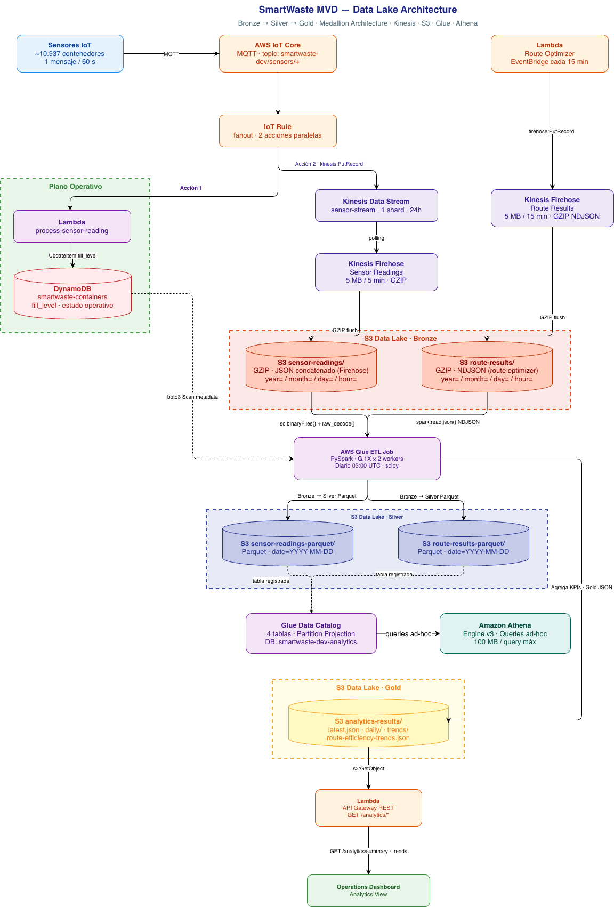

# Data Lake — SmartWaste MVD

Documentación técnica en profundidad del pipeline de datos histórico: desde la ingesta en tiempo real de los sensores y el optimizador de rutas hasta los resultados analíticos que consume el Dashboard de Operaciones.

> **Diagrama de arquitectura:** `docs/diagrams/datalake.drawio` (también en `docs/diagrams/datalake.png`)


---

## Visión general

El sistema tiene **dos planos de datos** completamente desacoplados:

| Plano | Propósito | Tecnología clave |
|-------|-----------|-----------------|
| **Operativo** | Estado tiempo real (fill levels, rutas activas) | DynamoDB + Lambda |
| **Analítico** | Histórico, tendencias, KPIs | S3 Data Lake + Glue + Athena |

El plano analítico es un pipeline clásico **Bronze → Silver → Gold** (medallion architecture) que se ejecuta una vez por día y produce los datos que consume la vista *Analytics* del dashboard. El plano operativo no se ve afectado en ningún momento por el ETL.

```
Sensores IoT ──MQTT──▶ IoT Core ──Rule──▶ [SQS → Lambda batch → DynamoDB]  ← plano operativo
                                       └──▶ [Kinesis → Firehose → S3 Bronze]  ← plano analítico
                                                                       ↓
Route Optimizer ──firehose:PutRecord──▶ Firehose ──▶ S3 Bronze routes
                                                              ↓
                                               Glue ETL (03:00 UTC) ── DynamoDB metadata
                                                    ↓
                                              S3 Silver (Parquet)
                                                    ↓
                                              S3 Gold (JSON)
                                                    ↓
                                             API Lambda ──▶ Dashboard
```

---

## 1. Fuentes de datos

### 1.1 Lecturas de sensores

Cada contenedor IoT publica lecturas cada ~60 segundos al topic MQTT `smartwaste-dev/sensors/{container_id}`:

```json
{
  "container_id": "12345",
  "fill_level":   73.4,
  "timestamp":    "2026-04-08T14:30:00Z",
  "battery":      87.2,
  "temperature":  24.1,
  "latitude":     -34.9011,
  "longitude":    -56.1645
}
```

Con ~10.937 contenedores activos y lecturas cada 60s, el volumen es **~10.937 mensajes/minuto** ≈ 656.000 mensajes/hora ≈ 15,7 millones de mensajes/día.

### 1.2 Resultados de rutas optimizadas

Cada vez que el route-optimizer termina de calcular una ruta, publica un registro de eficiencia directamente a Firehose:

```python
{
    "date":                     "2026-04-08",
    "circuit_id":               "A_DU_RM_CL_103",
    "route_id":                 "uuid-...",
    "truck_id":                 "truck-0",
    "created_at":               "2026-04-08T14:30:25.043671+00:00",
    "baseline_distance_m":      14200,   # ruta secuencial (baseline)
    "total_distance_m":         10800,   # ruta optimizada
    "baseline_duration_s":      5100,
    "total_duration_s":         3900,
    "baseline_stops":           42,
    "optimized_stops":          38,
    "stops_skipped":            4,
    "distance_improvement_pct": 23.9,
    "duration_improvement_pct": 23.5,
    "solver":                   "cuopt",
    "solver_status":            "OPTIMAL"
}
```

El optimizer corre cada 15 minutos, así que un circuito puede generar hasta ~96 registros por día (uno por run × 3 trucks). El ETL deduplica, quedándose solo con el **último run** del día por circuito.

---

## 2. Pipeline de ingesta

### 2.1 IoT Core → SQS + Kinesis (fanout)

La IoT Rule está configurada con un **fanout de 2 acciones** sobre el mismo topic. Ambas se ejecutan en paralelo con cada mensaje recibido:

```
Topic: smartwaste-dev/sensors/+
    ├── Acción 1: sqs:SendMessage → SQS queue smartwaste-dev-sensor-readings
    │     → event source mapping → Lambda batch (batch_size=100, ventana 10s)
    │     → UpdateItem fill_level + needs_collection en DynamoDB (plano operativo)
    │     → PutItem en sensor-readings (TTL 30d)
    └── Acción 2: kinesis:PutRecord en sensor-stream
          → Pipeline analítico
```

**Por qué SQS en lugar de invocar Lambda directamente:** el fanout desacopla los dos planos. Si Kinesis tiene un throttle o un error, no afecta la actualización operativa de DynamoDB y viceversa. Además, SQS evita el problema de throttling de concurrencia Lambda: ~10.937 invocaciones simultáneas se consolidarían en 10.937 Lambdas paralelas, superando el límite de concurrencia de la cuenta. Con SQS, el event source mapping agrupa los mensajes en ~110 batches de 100 mensajes cada uno, y `ReportBatchItemFailures` permite re-encolar individualmente los mensajes fallidos sin perder los exitosos.

La acción Kinesis usa el rol IAM `smartwaste-dev-iot-kinesis-ingest` con permiso mínimo: solo `kinesis:PutRecord` sobre `sensor-stream`.

### 2.2 Kinesis Data Stream

```
Nombre:     smartwaste-dev-sensor-stream
Mode:       ON_DEMAND  (anteriormente: 1 shard PROVISIONED, ~$10.80/mes → ahora ~$1.88/mes)
Retención:  24 horas
Producer:   IoT Core (via regla IoT)
Consumer:   Kinesis Firehose (polling automático)
```

En modo **ON_DEMAND**, Kinesis escala automáticamente la capacidad según el tráfico — sin necesidad de provisionar shards manualmente ni usar `UpdateShardCount`. El costo cambia de cargo fijo por shard a cargo por volumen de datos procesado, lo que reduce el costo en ~83% para el volumen actual de desarrollo (~182 msg/s en pico).

La retención de 24h es el mínimo de Kinesis. Si Firehose o el ETL falla, se puede hacer replay de las últimas 24h.

### 2.3 Kinesis Firehose — Sensor readings

```
Nombre:           smartwaste-dev-sensor-firehose
Source:           Kinesis Data Stream (polling)
Destination:      S3 Extended (extended_s3)
Buffer size:      5 MB  (flush cuando se alcanza cualquiera)
Buffer interval:  300 s (5 min)
Compresión:       GZIP
Prefix S3:        sensor-readings/year=!{timestamp:yyyy}/month=!{timestamp:MM}/
                  day=!{timestamp:dd}/hour=!{timestamp:HH}/
Error prefix:     sensor-readings-errors/
```

El prefijo usa **Hive-compatible partitioning** con las variables de Firehose (`!{timestamp:...}`). Esto permite a Athena usar **partition pruning**: una query con `WHERE year=2026 AND month=4 AND day=8` descarta el ~99.7% de los archivos sin leerlos.

**Cuidado importante:** Firehose escribe múltiples objetos JSON *concatenados sin separadores de línea* dentro de cada archivo GZIP. Esto es diferente a NDJSON (newline-delimited) y rompe `spark.read.json()` estándar que solo parsea el primer objeto. Ver sección [6.2 El problema del GZIP concatenado](#62-el-problema-del-gzip-concatenado).

### 2.4 Kinesis Firehose — Route results

```
Nombre:           smartwaste-dev-route-firehose
Source:           Direct PUT (no hay Kinesis Data Stream delante)
Buffer size:      5 MB
Buffer interval:  900 s (15 min — igual al ciclo del optimizer)
Compresión:       GZIP
Prefix S3:        route-results/year=.../month=.../day=.../hour=.../
```

A diferencia de las lecturas de sensores, las rutas se envían **directamente** desde la Lambda del optimizer via `firehose:PutRecord`. No hay Kinesis Data Stream intermedio porque el volumen es bajo (máx ~3 records/run × ~96 runs/día × 134 circuitos ≈ 38.000 records/día) y no necesita el buffer de reintento de un KDS.

El buffer de 900s se ajusta al ciclo del optimizer (15 min) para minimizar el número de archivos GZIP generados.

```python
# lambdas/route-optimizer/handler.py
if _firehose and route_summary:
    _firehose.put_record(
        DeliveryStreamName=_ROUTE_RESULTS_FIREHOSE,
        Record={"Data": json.dumps(route_summary) + "\n"},
    )
```

El `\n` al final es intencional: para route-results se usa NDJSON (un objeto por línea) porque los archivos son pequeños y `spark.read.json()` con `multiline=false` los parsea correctamente. No hay el problema de concatenación que tiene sensor-readings.

---

## 3. S3 Data Lake

### 3.1 Bucket

```
Nombre:          smartwaste-data-lake-dev
Región:          us-east-1
Encriptación:    SSE-S3 (AES-256, managed por S3)
Public access:   Completamente bloqueado (4 configuraciones de bloqueo)
Versioning:      Desactivado (no es necesario, los writes son idempotentes)
```

### 3.2 Estructura de prefijos

```
smartwaste-data-lake-dev/
│
├── sensor-readings/                          ← BRONZE (Firehose output)
│   └── year=2026/month=04/day=08/hour=14/
│       ├── smartwaste-dev-sensor-firehose-1-2026-04-08-14-00-00-xxxx.gz
│       └── smartwaste-dev-sensor-firehose-1-2026-04-08-14-05-00-yyyy.gz
│
├── sensor-readings-errors/                   ← Errores de Firehose (si los hay)
│
├── sensor-readings-parquet/                  ← SILVER (ETL output)
│   └── date=2026-04-08/
│       └── part-00000-....parquet
│
├── route-results/                            ← BRONZE (Firehose output)
│   └── year=2026/month=04/day=08/hour=14/
│       └── smartwaste-dev-route-firehose-1-2026-04-08-14-00-00-zzzz.gz
│
├── route-results-errors/                     ← Errores de Firehose
│
├── route-results-parquet/                    ← SILVER (ETL output)
│   └── date=2026-04-08/
│       └── part-00000-....parquet
│
├── analytics-results/                        ← GOLD (ETL output)
│   ├── latest.json                           ← siempre apunta a los datos más recientes
│   ├── daily/
│   │   └── 2026-04-08.json                   ← snapshot inmutable por día
│   ├── trends/
│   │   └── latest-trends.json                ← rolling 30 días de fill level por circuito
│   └── route-efficiency-trends.json          ← rolling 30 días de eficiencia de rutas
│
├── athena-results/                           ← staging temporal de Athena
└── glue-scripts/
    └── etl_daily.py                          ← script del job (subido por Terraform)
```

### 3.3 Lifecycle rules

**6 reglas consolidadas en un solo recurso Terraform** (anteriormente 2 recursos separados, el segundo sobreescribía al primero — bug corregido):

| Prefijo | STANDARD_IA | Expiración | Capa |
|---------|-------------|------------|------|
| `sensor-readings/` | Día 30 | Día 365 | Bronze |
| `route-results/` | Día 30 | Día 365 | Bronze |
| `sensor-readings-parquet/` | Día 60 | Día 730 | Silver |
| `route-results-parquet/` | Día 60 | Día 730 | Silver |
| `analytics-results/` | Día 30 | Día 365 | Gold |
| `athena-results/` | — | Día 7 | Staging |

Los datos Silver y Gold tienen lifecycle más largo porque son valiosos a largo plazo. Los resultados de Athena en `athena-results/` son solo staging temporal y se limpian a los 7 días.

---

## 4. Glue Data Catalog

### 4.1 Configuración

```
Database: smartwaste-dev-analytics
```

Cuatro tablas registradas, todas con **Partition Projection** habilitada. Esto significa que Athena sabe cómo construir las rutas S3 para cada partición sin necesitar un Glue Crawler que las descubra. El resultado:

- Costo: **$0** en catalog (sin crawler que corra periódicamente)
- Latencia de primera query: **inmediata** (sin esperar discovery)
- Mantenimiento: **cero** (las particiones son proyecciones matemáticas, no metadatos)

### 4.2 Tablas

| Tabla | Layer | Formato | Partición |
|-------|-------|---------|-----------|
| `sensor_readings` | Bronze | GZIP JSON (JsonSerDe) | year/month/day/hour (int) |
| `sensor_readings_parquet` | Silver | Parquet (nativo) | date (string YYYY-MM-DD) |
| `route_results` | Bronze | GZIP JSON (JsonSerDe) | year/month/day/hour (int) |
| `route_results_parquet` | Silver | Parquet (nativo) | date (string YYYY-MM-DD) |

Configuración de Partition Projection para las tablas Bronze (year/month/day/hour):
```hcl
"projection.enabled"      = "true"
"projection.year.type"    = "integer"
"projection.year.range"   = "2024,2030"
"projection.month.type"   = "integer"
"projection.month.range"  = "1,12"
"projection.month.digits" = "2"
"projection.day.type"     = "integer"
"projection.day.range"    = "1,31"
"projection.day.digits"   = "2"
"projection.hour.type"    = "integer"
"projection.hour.range"   = "0,23"
"projection.hour.digits"  = "2"
```

Para las tablas Silver (partición por `date`):
```hcl
"projection.enabled"         = "true"
"projection.date.type"       = "date"
"projection.date.range"      = "2024-01-01,NOW"
"projection.date.interval"   = "1"
"projection.date.format"     = "yyyy-MM-dd"
"projection.date.interval.unit" = "DAYS"
```

Las tablas Bronze tienen `ignore.malformed.json=true` en los parámetros SerDe para tolerancia a registros corruptos.

---

## 5. Glue ETL Job

El corazón del pipeline analítico. Se ejecuta **una vez por día** a las 03:00 UTC (00:00 Montevideo, UTC-3), cuando todos los datos del día anterior están en S3.

### 5.1 Configuración del job

```
Nombre:          smartwaste-dev-daily-analytics
Tipo:            glueetl (PySpark)
Glue version:    4.0
Python version:  3
Worker type:     G.1X  (4 vCPU, 16 GB RAM)
Workers:         2  (1 driver + 1 executor)
Timeout:         60 minutos
Max retries:     0  (si falla por datos faltantes, no tiene sentido reintentar el mismo día)
Módulos extra:   scipy  (via --additional-python-modules)
```

**Por qué G.1X y no Python Shell:** el ETL tiene operaciones Spark genuinas (leer GZIP → convertir a Parquet, aggregaciones sobre millones de filas de sensores). Python Shell está limitado a 0.0625 DPU y no tiene Spark. El paso de predicciones logísticas (scipy) corre en el driver, no en los executors.

**Por qué max retries = 0:** si falla a las 03:00 porque no hay datos en S3 para ayer (e.g., Firehose tuvo un problema), reintentar 1 hora después va a fallar igual. Mejor alertar y que un operador decida si hace backfill manual con `--RUN_DATE`.

**Argumento opcional `--RUN_DATE`:** permite procesar cualquier fecha histórica. Útil para backfill o para re-correr un día después de arreglar un bug en el script.

```bash
aws glue start-job-run \
  --job-name smartwaste-dev-daily-analytics \
  --arguments '{"--RUN_DATE":"2026-04-01"}' \
  --region us-east-1
```

### 5.2 Inicialización PySpark

```python
sc = SparkContext.getOrCreate()
glue_ctx = GlueContext(sc)
spark: SparkSession = glue_ctx.spark_session
job = Job(glue_ctx)
job.init(args["JOB_NAME"], args)
```

El `job.init()` + `job.commit()` al final es necesario para que Glue registre la ejecución como completada en el Job Bookmarks system (aunque no usemos bookmarks, es buena práctica y registra el estado en CloudWatch).

Los clientes `boto3` (DynamoDB, S3) se instancian una vez en el **driver** y no se pasan a los executors. Cualquier operación que necesite boto3 en ejecutores se implementa con `collect()` primero y luego se procesa en el driver.

### 5.3 Paso 1: Metadata de contenedores (driver-side, boto3)

```python
def load_container_metadata() -> dict[str, dict]:
    table = dynamodb.Table(CONTAINERS_TABLE)
    # Scan paginado con ProjectionExpression mínima
    # Retorna: {container_id → {circuit_id, shift, latitude, longitude, capacity_liters, zone}}
```

**Por qué un Scan completo de DynamoDB en lugar de un JOIN en Athena:** un DynamoDB Scan de ~10.937 items con ProjectionExpression de 6 atributos cuesta ~$0.003 y tarda ~2 segundos. Un JOIN en Athena requeriría tener los metadatos en S3, lo que complica el pipeline. Para este volumen, el Scan es más simple, más rápido y más barato.

La **zona** (`east`/`west`) se deriva del `circuit_id` en tiempo de ejecución:
```python
def _circuit_to_zone(circuit_id: str) -> str:
    cid = circuit_id.upper()
    if "_DU_" in cid or "_DI_" in cid:
        return "east"
    if "_RU_" in cid or "_RI_" in cid:
        return "west"
    return "unknown"
```

Esta lógica refleja la convención de nomenclatura de la Intendencia de Montevideo. `DU`/`DI` = zona este (departamento urbano), `RU`/`RI` = zona oeste (residencial urbano/industrial).

### 5.4 El problema del GZIP concatenado (Firehose Bronze)

Este es el problema más importante a entender del pipeline y el que más trabajo costó resolver.

Kinesis Firehose escribe los records en S3 como archivos GZIP, pero **sin separadores de nueva línea entre objetos JSON** dentro del mismo buffer. El resultado es un archivo como:

```
{"container_id":"1","fill_level":73.4,...}{"container_id":"2","fill_level":52.1,...}{"container_id":"3",...}
```

Todos en una sola línea, sin `\n` entre ellos.

`spark.read.json()` opera en modo NDJSON (newline-delimited): trata cada línea como un objeto JSON. Al no haber newlines, **todo el archivo es una sola "línea"** y Spark parsea solo el primer objeto. El resultado sería ~1 registro por archivo en lugar de los ~150 que debería haber.

**Solución: `sc.binaryFiles()` + parser personalizado**

```python
def _parse_concatenated_gz(path_content_pair: tuple) -> list:
    """
    Extrae objetos JSON individuales de un GZIP con múltiples objetos
    concatenados sin newlines (formato Kinesis Firehose).
    Usa JSONDecoder.raw_decode() para streaming a través del texto completo.
    Debe importar gzip y json localmente (se serializa a los executors).
    """
    import gzip as _gzip
    import json as _json

    _path, raw_bytes = path_content_pair
    text = _gzip.decompress(bytes(raw_bytes)).decode("utf-8")

    decoder = _json.JSONDecoder()
    results = []
    pos = 0
    while pos < len(text):
        while pos < len(text) and text[pos] in " \t\n\r":
            pos += 1
        if pos >= len(text):
            break
        obj, end_pos = decoder.raw_decode(text, pos)
        results.append(_json.dumps(obj))
        pos = end_pos
    return results
```

El flujo completo:
```python
# 1. Listar archivos en S3 (driver, boto3)
s3_file_uris = [f"s3://bucket/sensor-readings/year=2026/.../file.gz", ...]

# 2. Leer bytes crudos en paralelo (Spark)
raw_rdd = sc.binaryFiles(",".join(s3_file_uris))

# 3. Parsear cada archivo con el decoder personalizado (Spark executors)
json_lines_rdd = raw_rdd.flatMap(_parse_concatenated_gz)

# 4. Crear DataFrame desde RDD de strings JSON
df = spark.read.json(json_lines_rdd)
```

**Importante:** `_parse_concatenated_gz` debe importar sus dependencias localmente (`import gzip`, `import json`) porque cuando Spark serializa la función para enviarla a los executors, las referencias a módulos del scope global del driver no están disponibles en los workers.

**Por qué `binaryFiles` y no `sc.textFile` o `spark.read.json(path)`:**
- `sc.textFile` descomprime el GZIP pero sigue tratando cada línea como separada → mismo problema
- `spark.read.json(path)` no da control sobre el parsing
- `sc.binaryFiles` da bytes crudos completos del archivo → podemos aplicar nuestro parser

### 5.5 Paso 2: Bronze → Silver Parquet (sensor readings)

```python
silver_path = f"s3://{DATA_LAKE_BUCKET}/sensor-readings-parquet/date={date_str}/"
df.write.mode("overwrite").parquet(silver_path)
```

El `mode("overwrite")` hace los re-runs **idempotentes**: si el job falla a mitad y se re-ejecuta con `--RUN_DATE`, el Silver del día se sobreescribe limpiamente. Sin esta opción, las re-ejecuciones dejarían datos duplicados.

Después del write, el DataFrame Bronze se libera de memoria (`df.unpersist()`) para no presionar al garbage collector de los workers.

### 5.6 Paso 3: Aggregaciones Spark (sensor data)

Mientras el DataFrame Bronze está en memoria (cacheado con `.cache()`), se calculan dos DataFrames:

**Aggregaciones por contenedor** (`container_aggs`):
```python
container_aggs = df.groupBy("container_id").agg(
    F.count("*").alias("readings"),
    F.avg("fill_level").alias("avg_fill"),
    F.max("fill_level").alias("max_fill"),
    F.min("fill_level").alias("min_fill"),
    F.avg("battery").alias("avg_battery"),
    F.min("battery").alias("min_battery"),
    F.avg("temperature").alias("avg_temp"),
    F.max("temperature").alias("max_temp"),
)
```

**Patrón horario** (`hourly_pattern`):
```python
hourly_pattern = (
    df
    .withColumn("hour_of_day", F.hour(F.to_timestamp("timestamp")))
    .groupBy("hour_of_day")
    .agg(
        F.avg("fill_level").alias("avg_fill"),
        F.countDistinct("container_id").alias("containers"),
    )
    .orderBy("hour_of_day")
)
```

Estos DataFrames se mantienen en Spark (no se colectan al driver todavía) para que las aggregaciones posteriores puedan encadenarse. Se colectan al driver más tarde cuando se ensambla el Gold JSON.

### 5.7 Paso 4: Route results Bronze → Silver (Spark)

Las rutas Bronze tienen un tratamiento diferente: usan `spark.read.json()` con `recursiveFileLookup=true` y `multiline=false` porque son NDJSON normal (cada record termina en `\n`, lo escribimos así explícitamente desde el optimizer).

```python
df = (
    spark.read
    .option("recursiveFileLookup", "true")  # busca en todos los subdirectorios hour=HH
    .option("multiline", "false")
    .json(day_path)
    .filter(F.col("date") == date_str)      # filtro crítico (ver abajo)
    .filter(F.col("circuit_id").isNotNull())
    .cache()
)
```

**Filtro por `date` dentro del record:** Firehose puede bufferear records de varios días en el mismo archivo si el buffer (900s) cruza la medianoche. Un record de ruta generado a las 23:58 del día N puede caer en el archivo de la hora 00:XX del día N+1. Al leer el prefijo `day=N+1`, encontraríamos records del día N. El filtro `.filter(F.col("date") == date_str)` garantiza que solo procesamos records del día correcto independientemente del prefijo S3 en el que cayeron.

### 5.8 Paso 5: Deduplicación de rutas (Window function)

El optimizer corre cada 15 minutos. Para un circuito con 3 trucks, cada run genera 3 records en Firehose. En 24 horas, hasta 96 runs × 3 trucks = 288 records por circuito en el Bronze. Solo queremos **el último run del día** para las estadísticas de eficiencia.

```python
circuit_window = Window.partitionBy("circuit_id")
latest_routes_df = (
    routes_df
    .withColumn("ts_minute", F.substring("created_at", 1, 16))       # "2026-04-08T14:30"
    .withColumn("max_ts_minute", F.max("ts_minute").over(circuit_window))
    .filter(F.col("ts_minute") == F.col("max_ts_minute"))             # solo el último run
    .drop("ts_minute", "max_ts_minute")
)
```

**Por qué substring a 16 caracteres:** ISO 8601 (`2026-04-08T14:30:25.043671+00:00`) ordena correctamente como string hasta el nivel de minuto. Todos los trucks de un mismo run del optimizer tienen `created_at` con diferencia de microsegundos → caen en el mismo minuto → el filtro los agrupa correctamente como un solo run.

Después de filtrar, se agrupan los trucks del último run por circuito:
```python
circuit_agg = (
    latest_routes_df
    .groupBy("circuit_id").agg(
        F.sum("total_distance_m").alias("opt_dist_m"),       # suma de todos los trucks
        F.sum("total_duration_s").alias("opt_dur_s"),
        F.sum("optimized_stops").alias("opt_stops"),
        F.max("baseline_distance_m").alias("base_dist_m"),   # max porque la baseline es la misma
        F.max("baseline_duration_s").alias("base_dur_s"),
        F.max("baseline_stops").alias("base_stops"),
    )
    .filter(F.col("base_dist_m") > 0)
    ...
)
```

La baseline (ruta secuencial sin optimizar) es la misma para todos los trucks del run, por eso se usa `max` y no `sum`. El `filter(base_dist_m > 0)` elimina registros con baseline inválida.

Los UDFs `get_zone()` y `get_shift()` enriquecen cada fila con la zona y turno a partir del dict de metadata de contenedores, **broadcast** a todos los executors para evitar shuffle:

```python
zone_bc  = sc.broadcast(circuit_zone)   # dict {circuit_id → "east"/"west"}
shift_bc = sc.broadcast(circuit_shift)  # dict {circuit_id → "morning"/"afternoon"/"night"}

@F.udf(StringType())
def get_zone(circuit_id):
    return zone_bc.value.get(circuit_id or "", _circuit_to_zone(circuit_id or ""))
```

### 5.9 Paso 6: Predicciones logísticas (driver-side, scipy)

Las predicciones de cuándo se llenará cada contenedor se calculan en el **driver** (no en Spark) usando `scipy.optimize.curve_fit` para ajustar una curva logística a la serie temporal del día.

**¿Por qué en el driver y no en Spark?** `scipy` no es una librería distribuida y no puede correr en executors Spark. La forma correcta sería usar Pandas UDFs, pero para el volumen de datos (~10.000 contenedores con ~6 lecturas/hora) el collect al driver es manejable (~60.000 filas).

```python
# Curva logística: f(t) = 100 / (1 + e^{-k(t - t0)})
def _logistic(t: np.ndarray, k: float, t0: float) -> np.ndarray:
    return 100.0 / (1.0 + np.exp(-k * (t - t0)))

# Se filtra el Silver Parquet para contenedores con variación (std > 5%)
# y con al menos 4 lecturas. Se colectan en el driver y se ajusta la curva.
popt, _ = curve_fit(
    _logistic, hours, fill_values,
    p0=[0.3, 12.0],        # valores iniciales razonables
    bounds=([0, 0], [5, 24]),
    maxfev=2000,
)
k, t0 = popt

# Fill rate en el punto actual
current_fill = fill_values[-1]
fill_rate = k * current_fill * (1 - current_fill / 100)

# Horas hasta llegar al 80%
if current_fill < 80:
    hours_to_80 = (t0 - np.log(100/80 - 1) / k) - hours[-1]
```

Los contenedores recién vaciados (fill < 10% y std < 5%) se filtran para no intentar ajustar una curva plana que no converge.

### 5.10 Paso 7: Tendencias históricas de rutas (rolling 30 días)

El ETL también mantiene un archivo rolling de tendencias de eficiencia por circuito para los últimos 30 días:

```python
# 1. Lee el archivo de tendencias existente (si existe)
existing = s3.get_object(Bucket=DATA_LAKE_BUCKET, Key="analytics-results/route-efficiency-trends.json")
trends = json.loads(existing["Body"].read())["trends"]

# 2. Agrega los datos del día actual
for circuit_entry in route_efficiency["by_circuit"]:
    trends.append({
        "circuit_id": circuit_entry["circuit_id"],
        "date": date_str,
        "distance_improvement_pct": circuit_entry["distance_improvement_pct"],
        "distance_saved_km": round(...),
        "duration_saved_min": round(...),
    })

# 3. Elimina entradas de más de 30 días
cutoff = (date - timedelta(days=30)).strftime("%Y-%m-%d")
trends = [t for t in trends if t["date"] >= cutoff]

# 4. Reescribe el archivo
s3.put_object(Bucket=DATA_LAKE_BUCKET, Key="analytics-results/route-efficiency-trends.json",
              Body=json.dumps({"trends": trends}))
```

Este enfoque **incremental** evita leer todos los archivos `daily/*.json` para construir la ventana de 30 días, lo cual sería ineficiente.

### 5.11 Paso 8: Ensamblado y escritura Gold JSON

Una vez que todos los DataFrames Spark están calculados, se colectan al driver (`collect()`) y se ensambla el JSON Gold:

```python
gold = {
    "generated_at": datetime.now(timezone.utc).isoformat(),
    "date": date_str,
    "summary": { ... },       # contadores globales
    "by_circuit": [ ... ],    # estadísticas por circuito (del Spark agg + metadata DynamoDB)
    "by_zone": [ ... ],       # east / west
    "by_shift": [ ... ],      # morning / afternoon / night
    "hourly_pattern": [ ... ], # 24 puntos, avg fill por hora
    "hotspots": [ ... ],       # top 20 circuitos por avg fill
    "heatmap_data": [ ... ],   # [[lat, lon, intensity], ...] donde intensity = avg_fill/100
    "battery_alerts": [ ... ], # contenedores con batería < 20%
    "temperature_alerts": [ ...], # temperatura > 50°C
    "predictions": [ ... ],    # predicciones logísticas ordenadas por urgencia
    "route_efficiency": { ... } # si hay datos de rutas
}

# Escribe latest.json (sobreescribe)
s3.put_object(
    Bucket=DATA_LAKE_BUCKET,
    Key="analytics-results/latest.json",
    Body=json.dumps(gold, default=str),
    ContentType="application/json",
)

# Escribe daily snapshot (inmutable)
s3.put_object(
    Bucket=DATA_LAKE_BUCKET,
    Key=f"analytics-results/daily/{date_str}.json",
    Body=json.dumps(gold, default=str),
    ContentType="application/json",
)
```

El `default=str` en `json.dumps` maneja automáticamente tipos no serializables como `Decimal` que DynamoDB puede devolver.

`heatmap_data` se construye directamente de los datos de contenedores colectados:
```python
heatmap_data = [
    [meta["latitude"], meta["longitude"], round(stats["avg_fill"] / 100, 3)]
    for container_id, stats in container_stats_collected.items()
    if stats.get("avg_fill") and container_id in container_meta
    if (meta := container_meta[container_id])
]
```

El Dashboard consume `heatmap_data` directamente con `leaflet.heat`, donde el tercer elemento (`intensity = avg_fill / 100`) mapea al gradiente de color del heatmap.

---

## 6. Amazon Athena

### 6.1 Workgroup

```
Nombre:                smartwaste-dev-analytics
Engine:                Athena engine version 3
Output location:       s3://smartwaste-data-lake-dev/athena-results/
Cost control:          bytes_scanned_cutoff_per_query = 100 MB
CloudWatch metrics:    Habilitado
```

El límite de 100 MB por query es una guardia de seguridad para desarrollo. En producción se puede subir a 1 GB. Athena cancela automáticamente queries que excedan el límite antes de cobrar.

### 6.2 Uso en el proyecto

Athena está disponible para **queries ad-hoc** sobre los datos Silver (Parquet) o Bronze (GZIP JSON) usando las tablas del Glue Data Catalog. No forma parte del pipeline ETL automatizado — el Glue job usa Spark directamente.

Ejemplo de query ad-hoc útil:
```sql
-- Top 10 contenedores con más readings de overflow ayer
SELECT container_id, COUNT(*) as overflow_readings
FROM "smartwaste-dev-analytics"."sensor_readings_parquet"
WHERE date = '2026-04-08' AND fill_level >= 90
GROUP BY container_id
ORDER BY overflow_readings DESC
LIMIT 10;
```

Con partition projection, esta query solo lee los archivos Parquet del `date=2026-04-08/`, sin tocar los otros ~364 días.

---

## 7. API Lambda — Capa de consumo

La Lambda `api` lee los archivos Gold directamente desde S3. No hace queries Athena en tiempo real — el costo de procesamiento ya fue pagado por el ETL nocturno.

### 7.1 Endpoints de analytics

```
GET /analytics/summary
    → Lee: s3://.../analytics-results/latest.json
    → Respuesta: JSON completo (~100KB)
    → 404 si el ETL no corrió aún (latest.json no existe)
    → 503 si DATA_LAKE_BUCKET no está configurado

GET /analytics/trends?circuit_id=A_DU_RM_CL_103&days=30
    → Lee: s3://.../analytics-results/trends/latest-trends.json
    → Filtra por circuit_id (opcional) y últimos N días (max 365, default 30)
    → Respuesta: {"trends": [{circuit_id, date, avg_fill_level}, ...]}

GET /analytics/route-efficiency-trends?circuit_id=X&days=30
    → Lee: s3://.../analytics-results/route-efficiency-trends.json
    → Misma lógica de filtro
    → Respuesta: {"trends": [{circuit_id, date, distance_improvement_pct, ...}, ...]}
```

### 7.2 Latencia

Un `s3:GetObject` de 100KB desde Lambda (misma región, us-east-1) tarda tipicamente 20-50ms. No hay ningún procesamiento pesado en la Lambda — solo leer, filtrar en memoria si hay parámetros, y devolver.

---

## 8. IAM y seguridad

### 8.1 Roles

| Rol | Qué puede hacer |
|-----|-----------------|
| `smartwaste-dev-iot-kinesis-ingest` | `kinesis:PutRecord` sobre `sensor-stream` únicamente |
| `smartwaste-dev-firehose-sensor` | `kinesis:Get*/List*/Describe*/Subscribe*` sobre `sensor-stream` + `s3:PutObject` sobre `sensor-readings/*` |
| `smartwaste-dev-firehose-routes` | `s3:PutObject` sobre `route-results/*` y `route-results-errors/*` |
| `smartwaste-dev-glue-etl` | `s3:GetObject/PutObject/DeleteObject` sobre todo el bucket + `dynamodb:Scan` sobre `containers` y `routes` + AWSGlueServiceRole (logs) |
| `lambda-api` | `s3:GetObject` sobre `analytics-results/*` únicamente |

**Principio de mínimo privilegio:** el rol de Firehose de sensors no puede leer objetos S3 ni escribir en route-results. El rol de la API Lambda no puede escribir nada en S3. El Glue job tiene `s3:PutObject` en el root del bucket (necesario para que Spark pueda escribir el marcador de directorio vacío `_SUCCESS`), lo que es el único "exceso" de permisos necesario.

### 8.2 Flujo de credenciales

- Sensor Simulator → IoT Core: credenciales IAM del rol de la Lambda (no usa Thing certificates, simplificación deliberada para dev)
- Glue ETL → DynamoDB/S3: rol `smartwaste-dev-glue-etl` asumido automáticamente por el servicio Glue
- API Lambda → S3: rol del Lambda execution role

---

## 9. Costos estimados (dev, us-east-1)

| Recurso | Detalle | Costo/mes |
|---------|---------|-----------|
| Kinesis Data Stream | ON_DEMAND | ~$1.88 |
| Kinesis Firehose (sensors) | ~15.7M lecturas/día × 30 días ≈ 471M records ≈ ~450 GB antes GZIP ≈ ~90 GB GZIP | ~$8.50 (ingesta) + ~$2 (S3 Standard) |
| Kinesis Firehose (routes) | Volumen mínimo (<1 MB/día) | ~$0.00 |
| S3 Data Lake | ~90 GB Bronze + ~30 GB Silver + <1 MB Gold | ~$2.50/mes |
| Glue ETL Job | 2×G.1X × ~15 min/día × 30 días | ~$4.40 |
| Athena | Ad-hoc queries (estimado ~50 MB/día scanned) | ~$0.05 |
| **Total analítico** | | **~$28/mes** |

Con el cambio a ON_DEMAND, Kinesis ya no es el costo dominante. El costo dominante ahora es **Kinesis Firehose** (ingesta de datos). En producción, si el volumen de sensores sube, ON_DEMAND escala automáticamente sin intervención manual.

---

## 10. Comandos útiles

### Correr el ETL manualmente

```bash
# Correr el ETL para el día anterior (comportamiento normal)
aws glue start-job-run \
  --job-name smartwaste-dev-daily-analytics \
  --region us-east-1

# Correr el ETL para una fecha específica (backfill)
aws glue start-job-run \
  --job-name smartwaste-dev-daily-analytics \
  --arguments '{"--RUN_DATE":"2026-04-01"}' \
  --region us-east-1

# Ver estado de la ejecución
aws glue get-job-run \
  --job-name smartwaste-dev-daily-analytics \
  --run-id jr_xxxxxxxxxxxxxxxxxxxx \
  --region us-east-1 \
  --query 'JobRun.{State:JobRunState,Duration:ExecutionTime,Error:ErrorMessage}'

# Ver logs (Glue escribe a CloudWatch)
aws logs tail /aws-glue/jobs/output --follow --region us-east-1 \
  --filter-pattern '"smartwaste-dev-daily-analytics"'
```

### Verificar resultados en S3

```bash
# Ver si latest.json existe y cuándo fue generado
aws s3 ls s3://smartwaste-data-lake-dev/analytics-results/ --region us-east-1

# Descargar y ver las primeras líneas
aws s3 cp s3://smartwaste-data-lake-dev/analytics-results/latest.json /tmp/ --region us-east-1
cat /tmp/latest.json | python3 -m json.tool | head -60

# Contar archivos Bronze para un día específico
aws s3 ls s3://smartwaste-data-lake-dev/sensor-readings/year=2026/month=04/day=08/ \
  --recursive --human-readable --summarize --region us-east-1

# Ver archivos Silver Parquet
aws s3 ls s3://smartwaste-data-lake-dev/sensor-readings-parquet/date=2026-04-08/ \
  --region us-east-1
```

### Query ad-hoc con Athena

```bash
# Ejecutar una query
QUERY_ID=$(aws athena start-query-execution \
  --query-string "SELECT COUNT(*) FROM \"smartwaste-dev-analytics\".\"sensor_readings_parquet\" WHERE date='2026-04-08'" \
  --work-group smartwaste-dev-analytics \
  --region us-east-1 \
  --query 'QueryExecutionId' --output text)

# Esperar resultado
aws athena get-query-execution --query-execution-id $QUERY_ID \
  --region us-east-1 --query 'QueryExecution.Status'

# Ver resultado
aws athena get-query-results --query-execution-id $QUERY_ID \
  --region us-east-1
```

---

## 11. Decisiones de diseño y trade-offs

### ¿Por qué no usar Athena directamente desde el Dashboard?

La API podría hacer queries Athena en tiempo real cuando el usuario carga la vista Analytics. Los motivos para no hacerlo:

1. **Latencia:** una query Athena tarda 2-10 segundos. Un `s3:GetObject` de 100KB tarda <100ms.
2. **Costo:** Athena cobra por bytes escaneados. Con el dashboard polleando cada 30s, el costo se dispara.
3. **Complejidad:** Athena requiere polling del estado de la query (no es síncrono). Hay que implementar un mecanismo de espera.
4. **Datos del día actual:** Athena trabaja sobre datos que ya están en S3. Para el día actual, los datos aún están siendo escritos por Firehose en fragmentos. El ETL nocturno consolida todo. El dashboard sirve para análisis del día anterior, no tiempo real (para eso está la vista Mapa).

### ¿Por qué Bronze → Silver → Gold y no directamente a un resultado final?

- **Bronze** permite re-procesar cualquier día histórico con un script diferente sin necesidad de re-ingestar desde las fuentes.
- **Silver** (Parquet) permite a Athena hacer queries eficientes sin depender del Glue job. Si alguien quiere explorar datos ad-hoc, puede hacerlo sobre Parquet sin tocar el GZIP Bronze.
- **Gold** es un artefacto pre-calculado optimizado para el Dashboard. Si el schema del Gold cambia (nuevas métricas), se re-corre el ETL sobre Silver existente.

### ¿Por qué PySpark y no AWS Lambda para el ETL?

Lambda tiene límite de 15 minutos de ejecución y 10 GB de RAM. Para procesar ~15 millones de lecturas de sensores (450 GB sin comprimir), Lambda no es suficiente. PySpark en Glue distribuye el trabajo entre los 2 workers.

La librería `scipy` no es compatible con el entorno de AWS Lambda sin capas adicionales. Glue soporta `--additional-python-modules=scipy` nativamente.

### ¿Por qué el archivo de tendencias rolling en lugar de calcular desde los daily/*.json?

Con 30+ archivos `daily/*.json` de ~100KB cada uno, una Lambda que necesite mostrar tendencias tendría que descargar ~3MB de datos y parsearlos. Con el archivo rolling `latest-trends.json`, la Lambda descarga ~50KB y ya está filtrado.
